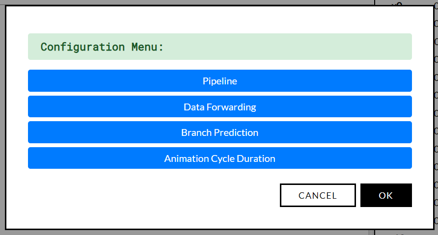
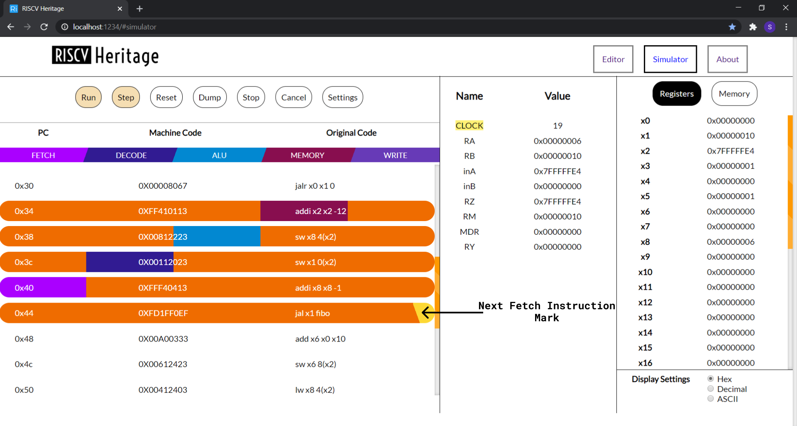
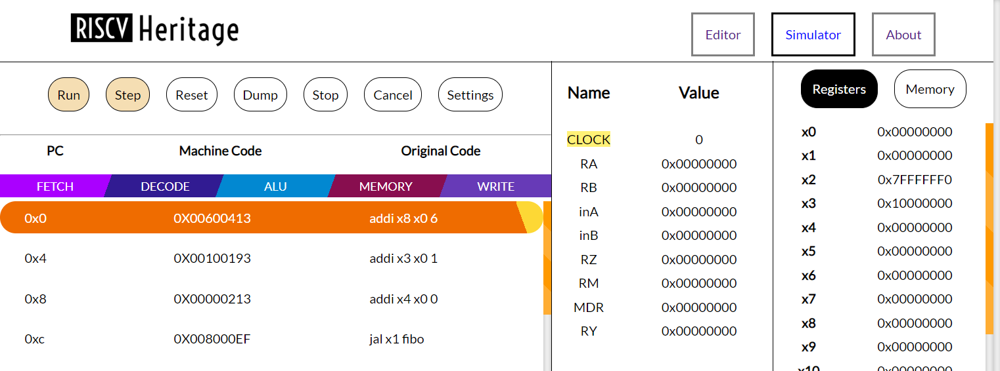
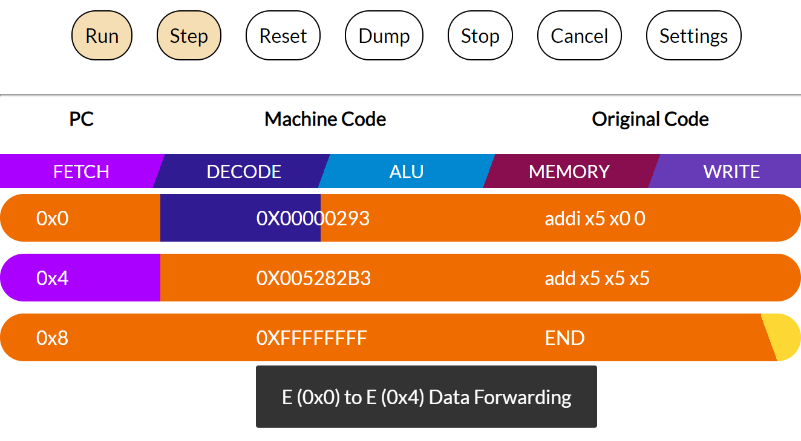

# RISCV Heritage

The following website is a course project under the guidance of [Dr T.V Kalyan](https://sites.google.com/view/kalyantv). It is a web simulator which converts the `Assembly code` written `RISCV syntax` to `Machine code` and provides a user-friendly environment for its execution. The simulator implements pipelining, branch prediction and data forwarding, which can be enabled or disabled by the user. 

## Valid Instructions

**R format:**
add, and, or, sll, slt, sra, srl, sub, xor, mul, div, rem

**I format:**
addi, andi, ori, lb, ld, lh, lw, jalr

**S format:**
sb, sw, sd, sh

**SB format:**
beq, bne, bge, blt

**U format:**
auipc, lui

**UJ format:**
jal

**Assembler Directives:**
.text, .data, .byte, .half, .word, .dword, .asciiz

## Team Members
| Name            | Entry Number |
|:---------------:| -----------: |
| [Bharat Ladrecha](https://github.com/Bh4r4t) | 2018CSB1080  |
| [Subham Sahu](https://github.com/subhamX/)     | 2018EEB1183  |


## Technology Stack
1. Typescript
2. HTML/CSS
3. NodeJS (For Development Only)

## File Structure
```
src
│   README.md
│   tsconfig.json
│
└───assets
   │   index.html
   │
   └───css
   │   style.css
   │    
   └───js
        │ main.ts
        │   
        └───encode
        │
        └───execute
```

**encode** contains files required to convert `Assembly Code` written in `RISC V` syntax into `Machine Code`  
**execute** contains files required to execute the generated `Machine Code`  
**main.ts** is the entrypoint of the application


## Features

1. On pressing `Ctrl+S` on **Editor Pane** current file will be downloaded.
2. On pressing `Ctrl+S` on **Simulator Pane** Output file will be downloaded if it's assembled.
3. **Editor Pane** supports `Ctrl+/` as comment shortcut
4. On pressing `Ctrl+D` on **Simulator Pane** stats file will be downloaded provided that execution is complete. 


## General Instructions To Run Locally

1. If you do not have a copy of `RISCV Heritage` clone the repo and checkout `GUI` branch. If you do have the project then go to `step 2`
```
git clone URL
git checkout GUI
```
2. Install all dependencies
```
npm install
```
3. Now to run the developement server run the following command in terminal
```
npm run start:dev
```
4. Now access the `RISCV Heritage` by visiting http://localhost:1234/
5. To build the project run the following command in terminal
```
npm run build
```


## Functionalities Our Project Offers


1. **BreakPoint:-** Users can use a breakpoint for debugging. Users can select as many breakpoints as s(he) wants. During the execution of instructions, the program will stop after the execution of selected instructions in the order of program flow.

2. **Run:-** To run the complete program in a single go, users can use it. For pipelined version the *animation cycle duration* can be tuned by the user from the settings menu.

3. **Step:-** Run the program instruction wise(one instruction at a time).

4. **Stop:-** Stop the execution process using the stop button.

5. **Reset:-** Reset the current execution process. It will also reset the memory and registers state.

6. **Dump:-** Users can copy the machine code to clipboard using it.

7. **Cancel:-** Destroys the current execution and moves one step back.

8. **Settings:-** Execution configuration can be changed by clicking this button before assembling the code. If assembled then it shows the configuration in READ ONLY mode. 



    * We provide our user with some options to enable/disable
        1. Pipelined execution
        2. Data Forwarding
        3. Branch prediction
        4. Animation Cycle Duration, to increase or decrease program execution speed for pipelined execution

9. Each pipelined instruction execution passes through five stages, Fetch, Decode, ALU,  Memory, and Write Back. All these stages are colour-coded. So when an instruction has completely executed in any stage, the instruction gets colour-coded with a colour corresponding to the pipeline stage.

<!-- Image Pipelined Instruction -->




10. We have added a separate pane for pipelined execution through which the user can see the current status of pipelined ISA.

<!-- Additional Reg Pane -->



11. To make the app more informative, whenever there is a stall, data forwarding, pipeline flushing or branch prediction etc. Our application shows a toast to notify such event.
<!-- Toast Pic -->




9. Memory Segment displays only those values into which something is explicitly written during program execution or in the data segment and all other values which are not shown are `0x00`

10. Although code segment data is shown in memory it cannot be retrieved by the user, by accessing that location. This is to ensure that there is no structural hazard.

11. On any error, the program will alert the user and will not proceed further for execution

12. Any instruction which uses **Double** like `sd, ld` are invalid since it is `32-bit system`

13. We have assumed that hazards are those dependencies which causes our pipeline to stall. So, any data dependency which are successfully handled by data forwarding won't be considered as a data hazard.


